# AutoVideo-Agent

<!-- ⬡ 3D-UPGRADE v1 by Mayank Bhaskar -->

**made by [Mayank Bhaskar](https://github.com/qtjg)** ·  

### 🧊 3D View

*Floating isometric render — layers hover, data particles stream, shine sweeps.*

---
🩺 **New tool — `repo-pulse`**: instant git pulse (28-day heat bars, hot files, contributors). Run: `python3 tools/repo_pulse.py`

**Turn a Markdown script into a reproducible video pipeline — storyboard, scene assets, timeline, QA, and MP4.**

Built for Codex, Claude Code, Gemini CLI and other coding-agent workflows. v0.1 is local-first and deterministic: it creates inspectable placeholder scene assets and an FFmpeg video without an API key or cloud account.

~~~text
Markdown Script -> Storyboard -> Scene Manifest -> Media -> Timeline -> FFmpeg -> QA -> MP4
~~~

> v0.1 does not claim AI video generation. Media uses deterministic placeholder scene assets; real providers are planned.

## Demo

The demo uses [examples/demo-script.md](examples/demo-script.md): three scenes and seven seconds.

~~~text
INPUT                         PIPELINE                         OUTPUT
examples/demo-script.md  ->  autovideo run              ->  video.mp4
                              parse + manifest + assets      manifest.json
                              silent WAV + FFmpeg            report.json
~~~

Run it:

~~~bash
autovideo run examples/demo-script.md
~~~

The build is written to build/demo-script/. Open video.mp4 when FFmpeg is available. Always inspect manifest.json and report.json; without FFmpeg the command reports status: degraded and keeps the inspectable assets.

## Quick Start

~~~bash
git clone https://github.com/wangxin6x/AutoVideo-Agent.git
cd AutoVideo-Agent
python -m pip install -e .
autovideo run examples/demo-script.md
~~~

FFmpeg is optional. With it, the output is an H.264 MP4 with a silent AAC track. Without it, scene cards, manifest, WAV timeline, and QA report are still produced.

## Features

| Status | Capability | Evidence |
| --- | --- | --- |
| ✅ Available now | Markdown storyboard parser | src/autovideo/parser.py |
| ✅ Available now | Scene manifest | manifest.json |
| ✅ Available now | Deterministic offline assets | PPM scene cards |
| ✅ Available now | Silent WAV timeline | audio-silence.wav |
| ✅ Available now | FFmpeg MP4 rendering | src/autovideo/render.py |
| ✅ Available now | Graceful degradation | report.json status |
| ✅ Available now | CLI | autovideo run <script.md> |
| ✅ Available now | QA report | report.json |
| ✅ Available now | Codex Skill / AGENTS integration | AGENTS.md and skills/auto-video/SKILL.md |
| 🚧 Planned | MiniMax | [#1](https://github.com/wangxin6x/AutoVideo-Agent/issues/1) |
| 🚧 Planned | ComfyUI | [#2](https://github.com/wangxin6x/AutoVideo-Agent/issues/2) |
| 🚧 Planned | TTS | [#3](https://github.com/wangxin6x/AutoVideo-Agent/issues/3) |
| 🚧 Planned | Subtitle alignment | [#4](https://github.com/wangxin6x/AutoVideo-Agent/issues/4) |
| 🚧 Planned | Real media adapters | [#5](https://github.com/wangxin6x/AutoVideo-Agent/issues/5) |

## Architecture

~~~mermaid
flowchart LR
    Script[Markdown Script] --> Parser[Script Parser]
    Parser --> Storyboard[Storyboard]
    Storyboard --> Manifest[Scene Manifest]
    Storyboard --> Providers[Provider Interface]
    Providers --> Media[Media assets]
    Media --> Timeline[Timeline]
    Timeline --> Renderer[Renderer]
    Renderer --> QA[QA report]
    QA --> MP4[MP4 output]
    VideoProvider[Video Provider - Planned] -. slot .-> Providers
    TTSProvider[TTS Provider - Planned] -. slot .-> Providers
    AssetProvider[Asset Provider - Planned] -. slot .-> Providers
~~~

The current renderer creates deterministic placeholder cards and a silent audio track. Provider slots are documented extension points, not shipped integrations.

## Use with Codex

Read AGENTS.md for repository rules, tests, security constraints, and the development loop. Then point Codex at skills/auto-video/SKILL.md for the local storyboard workflow:

> Turn examples/demo-script.md into a video and run QA. Use skills/auto-video/SKILL.md.

The real command is:

~~~bash
autovideo run examples/demo-script.md
~~~

QA means checking the command result plus report.json and manifest.json; there is no separate AI quality grader. This is a repository workflow, not an endorsement by Codex or any model vendor.

## Roadmap

- **v0.1 ✅** — Local parser, deterministic cards, silent timeline, FFmpeg MP4, degradation report, tests, and agent onboarding.
- **v0.2** — [MiniMax #1](https://github.com/wangxin6x/AutoVideo-Agent/issues/1), [ComfyUI #2](https://github.com/wangxin6x/AutoVideo-Agent/issues/2), [TTS #3](https://github.com/wangxin6x/AutoVideo-Agent/issues/3), [subtitle alignment #4](https://github.com/wangxin6x/AutoVideo-Agent/issues/4).
- **v0.3** — [media adapters #5](https://github.com/wangxin6x/AutoVideo-Agent/issues/5), [cross-platform FFmpeg #6](https://github.com/wangxin6x/AutoVideo-Agent/issues/6), [CI render coverage #9](https://github.com/wangxin6x/AutoVideo-Agent/issues/9), [more formats #10](https://github.com/wangxin6x/AutoVideo-Agent/issues/10).

## Community

- [Issues](https://github.com/wangxin6x/AutoVideo-Agent/issues)
- [Good First Issues](https://github.com/wangxin6x/AutoVideo-Agent/issues?q=is%3Aissue+is%3Aopen+label%3A%22good+first+issue%22)
- [Feature Requests](https://github.com/wangxin6x/AutoVideo-Agent/issues/new?labels=enhancement&template=feature_request.md)
- [Bug Reports](https://github.com/wangxin6x/AutoVideo-Agent/issues/new?labels=bug&template=bug_report.md)

Contributions to docs, examples, portability, and provider boundaries are welcome. Read AGENTS.md, add tests for core behavior, run python -m pytest, and review git diff --check before opening a pull request.

## Development

~~~bash
python -m pip install -e ".[test]"
python -m pytest
~~~

The runtime has no third-party dependencies. Never commit API keys, tokens, passwords, cookies, or machine-specific paths.

## 中文文档

[中文文档 -> README_CN.md](README_CN.md)

## License

MIT. See [LICENSE](LICENSE).
